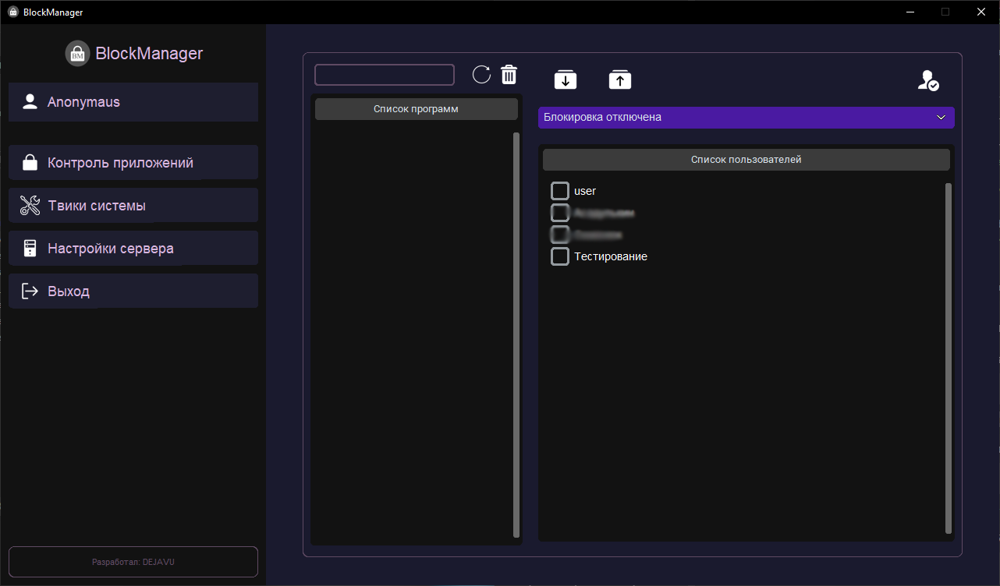
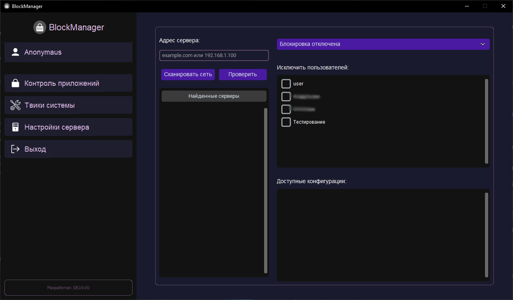

# BlockManager - Application Blocker 🛡️

  
  
  
  

**BlockManager** is a lightweight and secure Windows application control tool. The project is designed to manage application execution with two operational modes:

  <table>
    <tr>
      <th>🔴 Blacklist</th>
      <th>🟢 Whitelist</th>
    </tr>
    <tr>
      <td>Block only specified applications</td>
      <td>Allow only specified applications</td>
    </tr>
  </table>

---

## 🌟 Features

- 📋 Application list management
- ⚙️ Blocking mode configuration (Blacklist/Whitelist)
- 👥 User exceptions
- 🔄 Auto-start services
- 🌐 Server connectivity
- 🚀 Low resource consumption

---

## 🛠️ Installation

<b>🔧 (Manual Installation)</b>

1. Download the [latest release archive](https://github.com/dejavugd/BlockManager/releases)
2. Extract to `%ProgramFiles%/BlockManager`
3. Run **BlockManager.exe**
4. Create application list (drag and drop .exe files)
5. Select blocking mode
6. Configure user exceptions
7. Apply settings

---

## ⚠️ Important Warning

⚠️ When using Whitelist mode, ensure you include all system files, otherwise the system may become unstable!

---

## 🆘 Emergency Disable

> taskkill /IM blocker.exe /f

---

## 🌐 Server Configuration

> First install the [server component](https://github.com/dejavugd/BlockManagerServer/releases)

1. After installing [BlockManager](#setting)
2. Navigate to "Server Settings" tab
3. Enter IP/DNS or use "Network Scan"
4. Click "Test Connection"
5. Configure blocking mode
6. Set user exceptions
7. Select configuration file (in {Filename}.json format)

---

## 📸 Screenshots

| Main Interface | Server Settings |
|-------------------|-------------------|
|  |  |

---

## 📝 Logging

All activities are logged to:  
`%ProgramFiles%/BlockManager/logs`

---

## 👨‍💻 Author

  
   
  

---

## 📜 License

This project is licensed under the **MIT License**.  
Free for personal and commercial use.